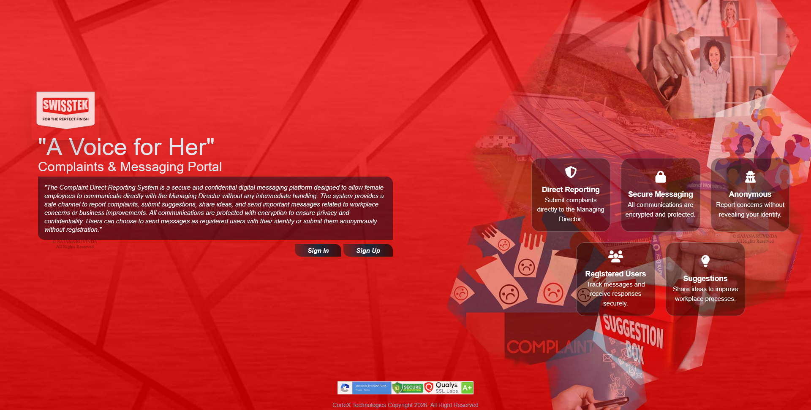
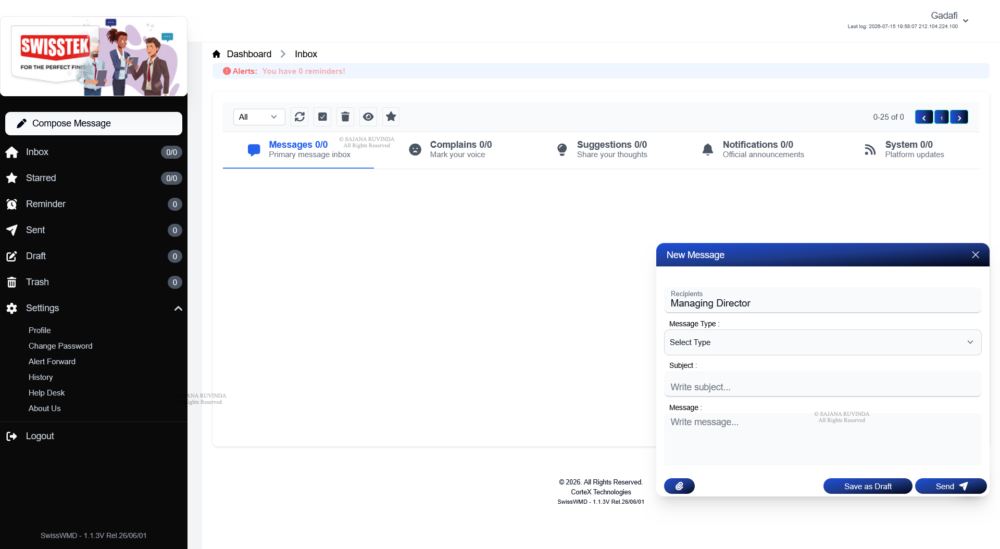
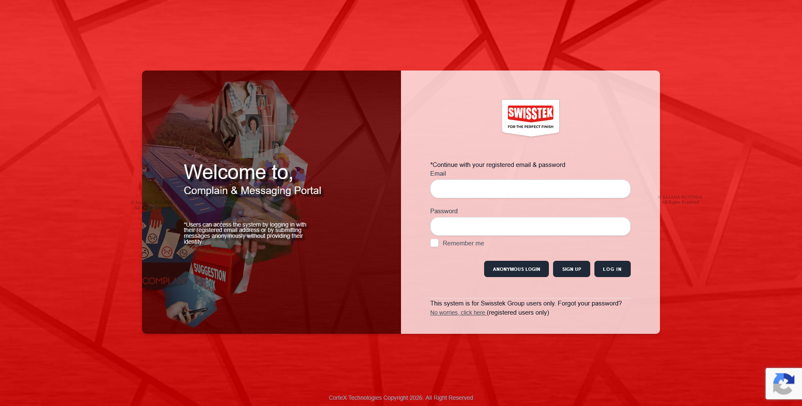
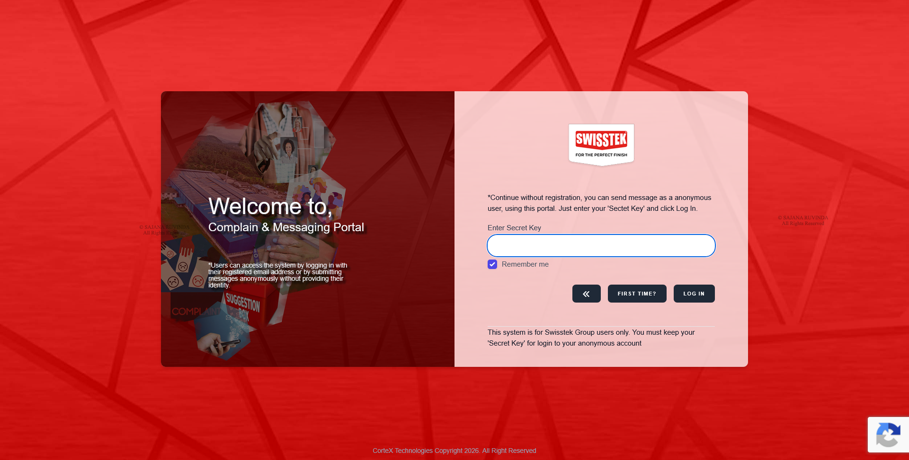

# WMD — Workforce Message Desk

## Overview

WMD (Workforce Message Desk) is a secure enterprise communication platform designed to provide employees with a dedicated channel for communicating directly with company employees and management.

Inspired by familiar email and messaging experiences, WMD focuses exclusively on internal corporate communication. The platform allows employees to submit general messages, complaints, suggestions, and confidential feedback through a centralized communication environment.

The system supports threaded conversations, file attachments, message categorization, reminders, anonymous communication, executive response management, security controls, and communication history.

Unlike traditional email systems, WMD is designed specifically for internal organizational communication and restricts registration to authorized company email domains.

---

## 🎯 Core Capabilities

- Internal employee communication
- General messages
- Complaints and suggestions
- Threaded conversations
- Executive communication
- Message categorization
- Gmail-style mailbox organization
- Draft management
- Reminder and snooze functionality
- Anonymous communication
- File attachments
- Email notifications
- Corporate domain authentication
- User profile and security management
- Activity and login history
- Audit logging
- Automatic trash management

---

## 📨 Secure Corporate Communication

WMD provides employees with a centralized communication channel for communicating with company management and authorized internal users.

Supported communication categories include:

- General Messages
- Complaints
- Suggestions

Each category can be managed and reviewed independently, helping organizations organize internal communication and employee feedback.

---

## 💬 Threaded Conversations

WMD uses a conversation-based messaging model that keeps related communications together.

### Features

- Continuous conversation history
- Reply chains
- Organized communication records
- Complete message context
- Centralized conversation history

This allows employees and management to continue discussions without losing the context of previous messages.

---

## 👔 Managing Director Communication Portal

WMD provides a dedicated management interface for executive communication.

Authorized management users can:

- View incoming employee messages
- Reply directly to conversations
- Manage threaded discussions
- Review historical communications
- Organize messages using labels
- Monitor employee feedback
- Track communication status

The portal provides a centralized workspace for managing employee communication and responses.

---

## 🏷️ Message Categorization

Management users can classify incoming communications using custom labels.

Example categories include:

- General
- Important
- Critical

Categorization helps prioritize incoming communications and provides a structured way to manage employee requests and feedback.

---

## 📬 Gmail-Style Organization

WMD provides a familiar mailbox-style interface to simplify communication management.

### Mailbox Sections

- Inbox
- Sent
- Drafts
- Starred
- Reminder
- Trash

Users can save unfinished messages as drafts and return to them later before sending.

---

## ⏰ Reminder & Snooze System

WMD includes a reminder system inspired by modern email snooze functionality.

Users can postpone messages and return to them later.

The system automatically returns postponed messages to the reminder workflow after the selected period.

This helps users manage pending communications and follow-up activities efficiently.

---

## 🕵️ Anonymous Communication

WMD provides an anonymous communication mode for employees who need to submit confidential complaints or suggestions without directly identifying themselves.

Anonymous communication is managed through a dedicated anonymous account protected by a unique secret access key.

### Features

- Identity-protected communication
- Anonymous complaint submission
- Anonymous suggestions
- Secret-key authentication
- Confidential communication with management
- Controlled access to anonymous conversations

The anonymous access mechanism is designed so that access to the anonymous account is controlled through the corresponding secret key.

---

## 📎 File Attachments

Users can attach supporting files when submitting messages or providing additional information.

### Supported Content

- Images
- Supporting documents
- Complaint evidence
- Reference files

Secure file handling allows supporting information to remain associated with the relevant communication thread.

---

## 🔔 Email Notification System

WMD provides automated email notifications for important communication and account events.

### Notification Events

- Successful login alerts
- New message notifications
- Executive reply notifications
- Security alerts

These notifications help users remain informed without continuously monitoring the application.

---

## 🔐 Corporate Domain Authentication

To maintain an internal communication environment, WMD restricts account registration to authorized company email domains.

### Security Features

- Company domain verification
- Corporate user authentication
- Controlled employee registration
- Internal-only communication environment
- Account security controls

This approach helps prevent unauthorized external users from registering within the organization's communication environment.

---

## 👤 User Profile & Security

Users can manage their account through a dedicated settings and security area.

### Available Functions

- Profile management
- Password updates
- Email notification preferences
- Login history
- Activity history
- Security settings

The system provides users with visibility into their account activity and security-related information.

---

## 🗑️ Automatic Trash Management

Deleted messages are retained temporarily before permanent removal.

### Trash Workflow

```text
Message Deletion
       ↓
     Trash
       ↓
30-Day Retention
       ↓
Message Recovery
       │
       └──────► Permanent Deletion
```

The retention workflow allows users to recover deleted messages during the configured retention period before automatic permanent deletion.

---

## 🔄 Communication Workflow

WMD provides a structured communication lifecycle between employees and management.

```text
Employee
   ↓
Message / Complaint / Suggestion
   ↓
Message Categorization
   ↓
Management Review
   ↓
Executive Response
   ↓
Threaded Conversation
   ↓
Historical Communication Record
```

For confidential communication:

```text
Employee
   ↓
Anonymous Communication
   ↓
Secret-Key Protected Account
   ↓
Management Review
   ↓
Confidential Response
   ↓
Protected Conversation History
```

---

## 🏗️ System Architecture

WMD combines several application components into a centralized internal communication platform.

```text
                    WMD
                     │
        ┌────────────┼────────────┐
        │            │            │
        ▼            ▼            ▼
   Employee      Management    Anonymous
   Portal          Portal       Channel
        │            │            │
        └────────────┼────────────┘
                     │
                     ▼
             Messaging Engine
                     │
        ┌────────────┼────────────┐
        │            │            │
        ▼            ▼            ▼
    Threads      Attachments   Notifications
        │            │            │
        └────────────┼────────────┘
                     ▼
              Audit & History
```

---

## 🛠️ Technology Stack

### Backend

- Laravel
- PHP
- MySQL

### Frontend

- Tailwind CSS
- JavaScript
- AJAX

### Application Technologies

- Threaded Messaging Engine
- Email Notification System
- Secure File Uploads
- Company Domain Authentication
- Anonymous Secret-Key Authentication
- Rich Text Messaging
- Scheduled Reminder System
- Audit Logging
- REST APIs

---

## 🎯 Business Objectives

WMD was designed to help organizations:

- Provide a centralized communication channel between employees and management
- Encourage structured employee feedback
- Support confidential complaints and suggestions
- Improve communication transparency
- Organize conversations through threaded messaging
- Centralize executive communication
- Improve response tracking
- Reduce fragmented internal email communication
- Protect access through company domain authentication
- Maintain communication history and audit records
- Provide structured management of employee feedback

---

## 📊 Communication & Management Benefits

The platform provides organizations with a structured approach to internal communication.

Key benefits include:

- Centralized employee communication
- Structured complaint and suggestion management
- Improved executive response workflows
- Organized conversation history
- Confidential communication capabilities
- Automated notification workflows
- Better communication traceability
- Controlled corporate access
- Reduced dependency on scattered email conversations

---

## 👨‍💻 My Role

I was responsible for the design and development of the WMD platform, including:

- Application architecture
- Backend development
- Database design
- Messaging architecture
- Threaded conversation functionality
- Business logic implementation
- User authentication
- Corporate domain validation
- Anonymous communication functionality
- Secret-key authentication
- File attachment handling
- Email notification workflows
- Reminder and snooze functionality
- Message categorization
- User profile and security functionality
- Audit logging
- Frontend and user-interface development
- Application deployment
- Production troubleshooting
- Production maintenance

---

## 🖥️ Screenshots

Selected screenshots demonstrating the application's major workflows and interfaces will be added to this repository.

### Landing Page


### Inbox & Features


### Gmail Style Dashboard


### Login Portal


### Anonymous Communication



---

## 🔒 Source Code

The source code for WMD is not included in this repository.

This repository serves as a technical case study documenting the platform's architecture, functionality, technology stack, security model, communication workflows, and my contribution to the project.

---

## 📌 Project Information

| Category | Details |
|---|---|
| Project Type | Enterprise Communication Platform |
| Domain | Internal Corporate Communication |
| Backend | Laravel / PHP |
| Frontend | Tailwind CSS / JavaScript / AJAX |
| Database | MySQL |
| Authentication | Corporate Domain Authentication |
| Communication | Threaded Messaging |
| Notifications | Email |
| File Handling | Secure File Uploads |
| Security | Secret-Key / Account Security |
| Integration | REST APIs |
| Status | Production Business Application |

---

## 📁 Repository Purpose

This repository is maintained as part of my professional software engineering portfolio.

It demonstrates experience in designing and developing secure enterprise communication systems, implementing threaded messaging architectures, confidential communication workflows, corporate authentication, automated notifications, file handling, audit logging, and business-focused internal applications.

The repository intentionally contains documentation, architecture information, screenshots, and project details rather than application source code.
